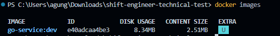
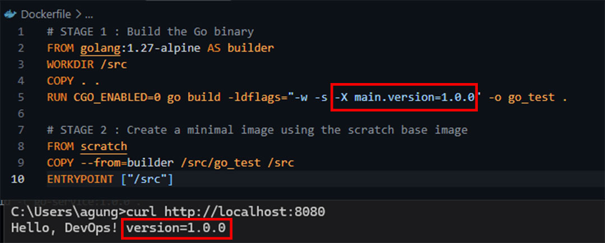
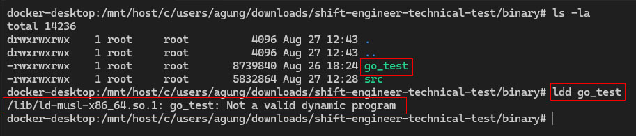

# Shift Engineer Technical Test

Technical test submission for the Shift Engineer position at PT Simple Journey Indonesia.

## Overview

A simple Go HTTP service packaged and deployed using Docker.

The application exposes an HTTP endpoint on port `8080` and returns the
application name and build version.

## Tech Stack

- Go 1.27
- Docker
- Alpine Linux
- Scratch

---

# Part I — Build

## 1. Multi-stage Docker Build

The application is built using a multi-stage Dockerfile.

The first stage uses `golang:1.27-alpine` as the build environment. The Go
source code is compiled into a statically linked Linux binary.

The final stage uses `scratch` as the runtime image and contains only the
compiled application binary.

### Why `scratch`?

`scratch` was chosen because the application can run as a standalone
statically linked binary and does not require a shell, package manager,
Go toolchain, or additional runtime dependencies.

Using `scratch` removes unnecessary components from the final image,
resulting in a smaller runtime image and a reduced attack surface.

### Static Binary

The binary is built with `CGO_ENABLED=0`, which disables CGO and allows
the application to be compiled without dependencies on shared libraries.

The resulting binary was verified using `ldd` and reported as:

    Not a valid dynamic program

This indicates that the binary does not use the dynamic musl loader or
shared-library dependencies.

---

## 2. Version Injection

The application version is injected during the build process using Go
linker flags (`-ldflags`).

Example:

    docker build -t go-service:dev .

The source code keeps the default version as `dev`, while the build process
can inject a specific release version.

Example output:

    Hello, DevOps! version=dev

---

## 3. Build the Docker Image

### Build Command

    docker build -t go-service:dev .

### Image Size

The final image uses `scratch`, so the Go compiler, source code, and build
dependencies are not included in the runtime image. Only the compiled
application binary is copied into the final stage.

---

## 4. Run the Application

### Run Command

    docker run -p 8080:8080 go-service:dev

The application listens on port `8080`.

### Verification

    curl http://localhost:8080

Expected response:

    Hello, DevOps! version=dev

---

## Screenshots

### Docker Build

### Image Size

### Version Injection

### Static Binary Verification

---

# Part II — Deploy

> To be completed.

---

# Part III — CI/CD with Jenkins

> To be completed.

---

# Rollback Strategy

> To be completed in Part III.