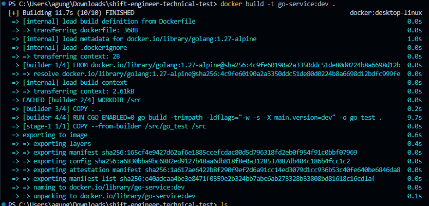
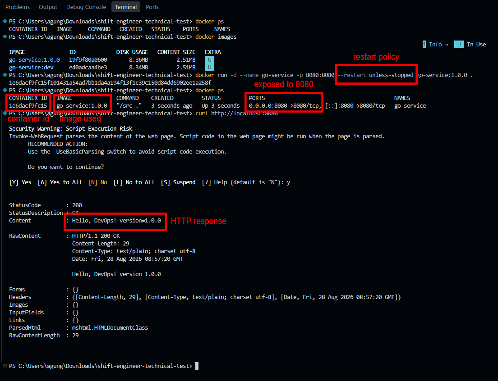
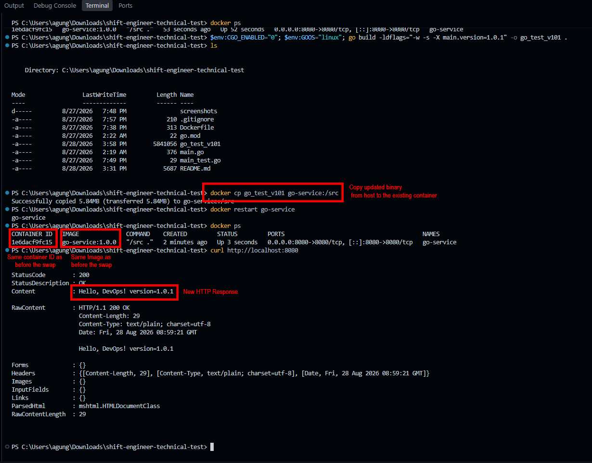

# Shift Engineer Technical Test

Technical test submission for the Shift Engineer position at PT Simple Journey Indonesia.

## Overview

A simple Go HTTP service packaged and deployed using Docker.

The application exposes an HTTP endpoint on port `8080` and returns the
application name and build version.

## Tech Stack

- Go 1.27
- Docker
- Alpine Linux
- Scratch

---

# Part I — Build

## 1. Multi-stage Docker Build

The application is built using a multi-stage Dockerfile.

The first stage uses `golang:1.27-alpine` as the build environment. The Go
source code is compiled into a statically linked Linux binary.

The final stage uses `scratch` as the runtime image and contains only the
compiled application binary.

### Why `scratch`?

`scratch` was chosen because the application can run as a standalone
statically linked binary and does not require a shell, package manager,
Go toolchain, or additional runtime dependencies.

Using `scratch` removes unnecessary components from the final image,
resulting in a smaller runtime image and a reduced attack surface.

### Static Binary

The binary is built with `CGO_ENABLED=0`, which disables CGO and allows
the application to be compiled without dependencies on shared libraries.

The resulting binary was verified using `ldd` and reported as:

    Not a valid dynamic program

This indicates that the binary does not use the dynamic musl loader or
shared-library dependencies.

---

## 2. Version Injection

The application version is injected during the build process using Go
linker flags (`-ldflags`).

Example:

    docker build -t go-service:dev .

The source code keeps the default version as `dev`, while the build process
can inject a specific release version.

Example output:

    Hello, DevOps! version=dev

---

## 3. Build the Docker Image

### Build Command

    docker build -t go-service:dev .

### Image Size

The final image uses `scratch`, so the Go compiler, source code, and build
dependencies are not included in the runtime image. Only the compiled
application binary is copied into the final stage.

---

## 4. Run the Application

### Run Command

    docker run -p 8080:8080 go-service:dev

The application listens on port `8080`.

### Verification

    curl http://localhost:8080

Expected response:

    Hello, DevOps! version=dev

---

## Screenshots

### Docker Build

### Image Size

### Version Injection

### Static Binary Verification

---

# Part II — Deploy

## 4. Run the Container

The Docker image is run as a detached container with port `8080` exposed
to the host. The `unless-stopped` restart policy is used so the container
automatically restarts if the application process exits unexpectedly.

### Run Command

    docker run -d --name go-service -p 8080:8080 --restart unless-stopped go-service:dev

### Verification

    docker ps

    docker inspect -f "{{.HostConfig.RestartPolicy.Name}}" go-service

Expected restart policy:

    unless-stopped

The application can be accessed from the host using:

    curl http://localhost:8080

---

## 5. Binary Hotfix

The `docker cp` approach was chosen to simulate a small production hotfix.

First, the existing container is verified to be running the original
application version:

    curl http://localhost:8080

    Hello, DevOps! version=1.0.0

A new statically linked Linux binary is then built on the host with the
updated version:

    CGO_ENABLED=0
    GOOS=linux

    go build -ldflags="-w -s -X main.version=1.0.1" -o go_test_v101 .

The new binary is copied directly into the existing container:

    docker cp go_test_v101 go-service:/src

The container is then restarted:

    docker restart go-service

No Docker image rebuild or container removal is performed during the
hotfix process.

---

## 6. Hotfix Verification

After restarting the existing container, the endpoint is queried again:

    curl http://localhost:8080

Expected response:

    Hello, DevOps! version=1.0.1

This demonstrates that the running binary was successfully replaced from
version `1.0.0` to `1.0.1` without rebuilding the Docker image.

The container remains the same deployment unit throughout the process,
while only the executable binary is replaced.

### Before Hotfix

### Binary Swap and Restart

### Hotfix Approach

I chose `docker cp` because it is simple and fast for a small hotfix.
I can build the updated binary on the host, copy it into the existing
container, and restart it without rebuilding the image or creating a new
container. This keeps the downtime minimal. The downside is that the
container filesystem becomes mutable, so this is better for quick hotfixes
than normal production deployments.

---

# Part III — CI/CD with Jenkins

> To be completed.

---

# Rollback Strategy

> To be completed in Part III.